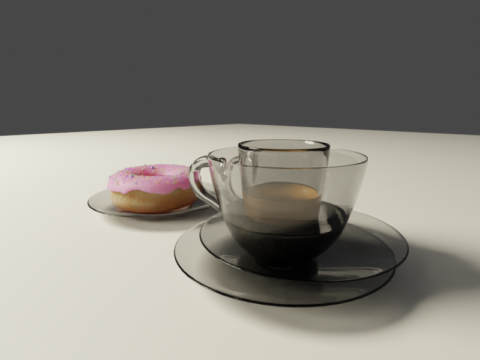

Blender Stuff
=============

My student files for https://www.udemy.com/blenderenvironment and
https://www.youtube.com/playlist?list=PLjEaoINr3zgEq0u2MzVgAaHEBt--xLB6U. 

## Current Issues (2.81 unless mentioned otherwise)

### Outstanding

### Resolved
1. ~~Renders happen twice. Sometimes the second pass it will render all my hidden stuff and then remove    it in the last moment before render completes. Other times the hidden stuff is there.~~ **Answer:** In View Layer, I checked `Render Single Layer` and that fixed it.
2. ~~HOW DO I MAKE IT NOT RENDER HIDDEN STUFF??? [1] IIRC older versions let you select item-by-item
   what would be shown in the viewport and in the render.~~ **Answer:** Click the Funnel icon in the 
   object organizer area (top right) and click `Disable in Renders`. This adds an icon to the organizer that you can then click to hide in the render. Shift-click to hide children, too.
3. ~~For my coffee mug and saucer, when transmission is 1 and roughness is 0, Blender is "helpfully"
    using [some sort of river rock texture](https://www.youtube.com/watch?v=TaRx-s5RH6Q) that 
    comes from who-knows-where. [This .blend file](https://github.com/bbhart/blenderstuff/blob/52cb4cbfa4dcebf28826a55b27d10801fd723888/donut-blender28/donut-and-coffee.blend) should show 
    the problem.~~ **Answer:** Seems this is by design. It projeccts a random HDRI background onto
    the mesh in Look Dev mode since it can't do the glass or transparent materials in this mode.
4. ~~When moving an object: even when I'm in axis restrict mode (e.g. only move on Y), Blender
    will still move on other axis if another object is encountered. I Do. Not. Want. This.
    I'd just hide the other object, but I need it to help me align. [Here's a video](https://www.youtube.com/watch?v=axg2Etkm6s4).~~ **Answer:** Unclick the magnet icon so it doesn't snap 
    during transform.

## Random notes

* Can't zoom in anymore? Turn off Perspective Mode with numpad-5.
* To "bridge" empty faces (like on the coffee cup handle):
    * Delete the opposing faces
    * Select vertices on both sides (4 on each side if square/rectangular)
    * Hit F3 and look for Bridge Edge Loops
* Use Solidify modifier in object mode to give something thickness
* Use Subdivide Surface modifier to add geometry

## "Creating the coffee"
_Documenting this on its own since it gave me problems._
* Make sure you've applied your Subdivide Surface. This will let you select inside faces.
* Double-check that the bottom normals are facing up (blue). 
    * Can check in Viewport Overlays -> Face Orientation. Blue is good, red is bad. 
    * If bad, then select and recalculate normals.
* Use your favorite method to select faces within the cup. (I used circle select)
* Shift-D to duplicate.
* P to separate (by Selection)

## Other Stumbling Blocks
* Weird shit happening when moving vertices? Check your Proportional Editing setting

## Renders Showing Problems

Rendering hidden things [1]:

