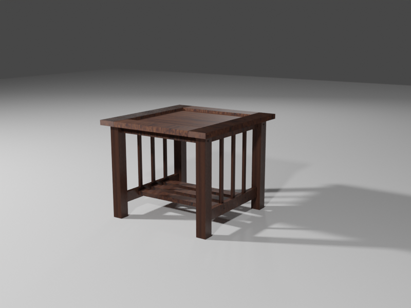

# Blender A Day
Very unlikely I'll do this **every** day but I'll try to either create something new
or improve on something previous at least a few times a week.

## 01

- Date: Jan 1, 2020
- Description: one of our side tables that is also our "server cabinet" for network stuff
- Resources: wood textures from [https://www.cgbookcase.com/textures/wood-07].
- Issues/lessons:
    * Can't get the textures looking right; need to learn lots more about materials in general
    * Everything's too pointy; should have small gouges and scuffs, plus smoother edges that wouldn't kill a person

