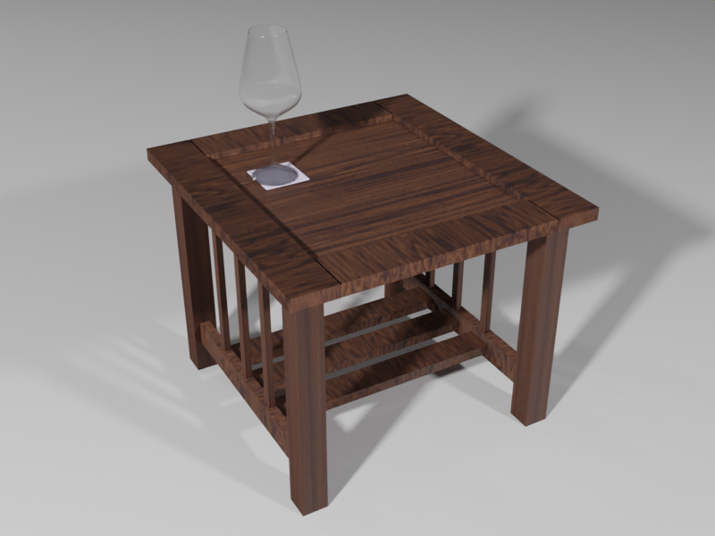

# Blender A Day
Very unlikely I'll do this **every** day but I'll try to either create something new
or improve on something previous at least a few times a week.

## 003 - Wine Glass

- Date: Jan 2, 2020
- Description: modeled a wine glass, added to previous scene
- Resources: random reference image from Google
- Issues/lessons:
    * Unhappy with base of wine glass but don't know how to fix
    * Glass has too much geometry, too, making it difficult to edit
    * Tried to add wine to the glass but wasn't able to select the inside faces I wanted to duplicate
    * Will have to fix the horrid wood texture in a future submission

## 002 - Animation

- Date: Jan 1, 2020
- Description: add an animation to the side table
- Resources: previous modeling of a donut I made following [Blender Guru's Blender 2.8 Tutorial](https://www.youtube.com/playlist?list=PLjEaoINr3zgEq0u2MzVgAaHEBt--xLB6U)
- Issues/lessons:
    * Donut still rattles around too much after landing (like a coin would) but bounciness is low and friction is high, so not sure
    * Would be cool if some of the sprinkles fell off

[See the video](https://player.vimeo.com/video/382501009)

## 001 - Mission style table

- Date: Jan 1, 2020
- Description: one of our side tables that is also our "server cabinet" for network stuff
- Resources: wood textures from [https://www.cgbookcase.com/textures/wood-07].
- Issues/lessons:
    * Can't get the textures looking right; need to learn lots more about materials in general
    * Everything's too pointy; should have small gouges and scuffs, plus smoother edges that wouldn't kill a person

