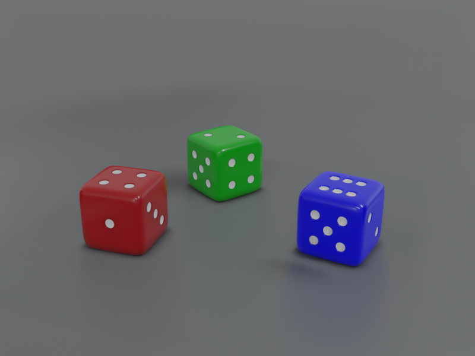

Blender Environments
====================

From the course [Udemy: Blender Environments](https://www.udemy.com/course/blender-environments/).

Some HDRI's from [HDRIHaven](https://hdrihaven.com/).
Some textures from [Texture Haven](https://texturehaven.com/).

Course notes:

1. Not for beginners. Assumes you're already comfortable with things like object mode vs edit mode, selecting between 
vertex/edge/face select modes, grabbing and moving.

Dice
----

Dice is the warm-up project. Learned about:

* Poke. Take four planes and poke them downward, which then creates a nice clean divot once subsurface modifier is added.
* HDRI background. In World, click the circle next to Color and then you can do an environment texture. Play with the Strength 
    attribute to tune things.
* Reflection Cubemap and IrradianceVolume (though I often have a hard time seeing the differences).
* In render tab, with Evee, bumping up Sampling, checking Ambient Occlusion and Screen Space Reflections, and baking lighting.

